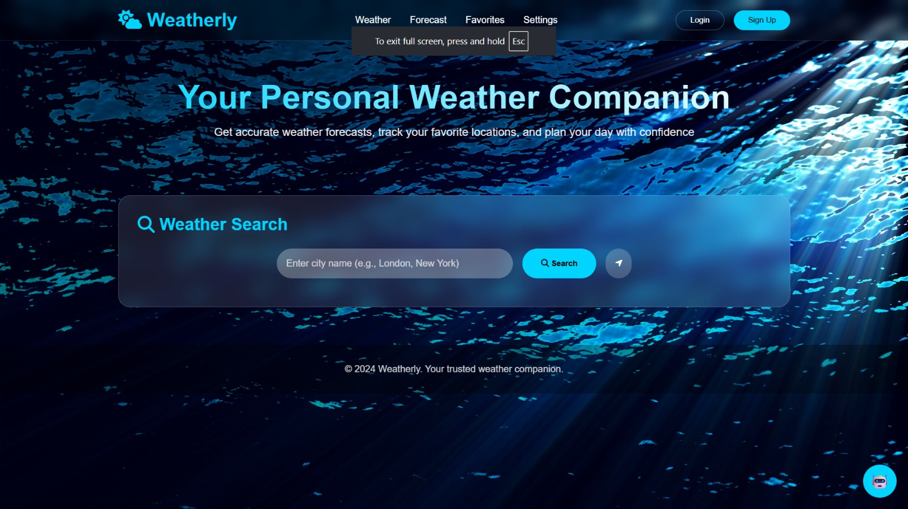
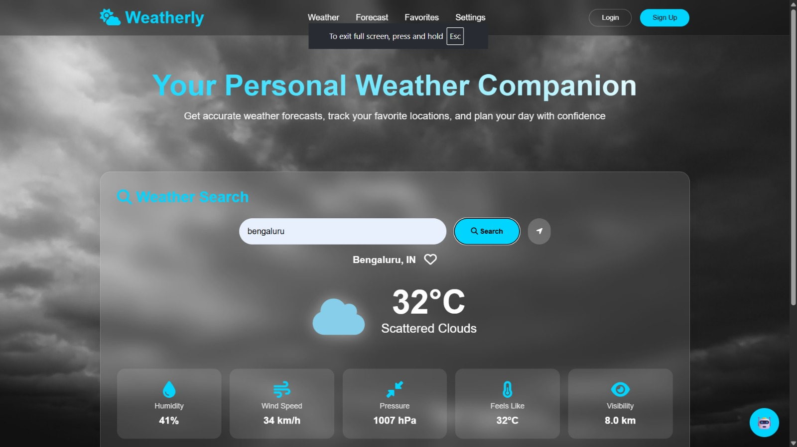

# 🌦️ Weatherly – AI Powered Weather App

A full-stack weather application that provides real-time weather updates with an AI chatbot.

## 🚀 Features
- 🌍 Search any city
- 📅 5-day forecast
- 🌫️ AQI, humidity, wind, pressure
- 🤖 AI chatbot integration
- 🔐 Login & Signup authentication
- 🎥 Dynamic UI with weather-based backgrounds

## 🛠 Tech Stack
- Frontend: HTML, CSS, JavaScript
- Backend: Node.js, Express.js
- Database: MongoDB
- API: OpenWeather API

## 📸 Screenshots





## 🔗 Run Locally
```bash
npm install
npm start
